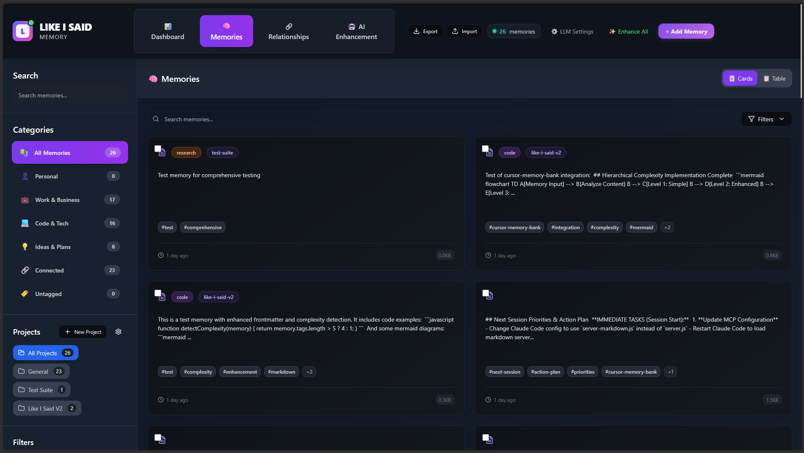
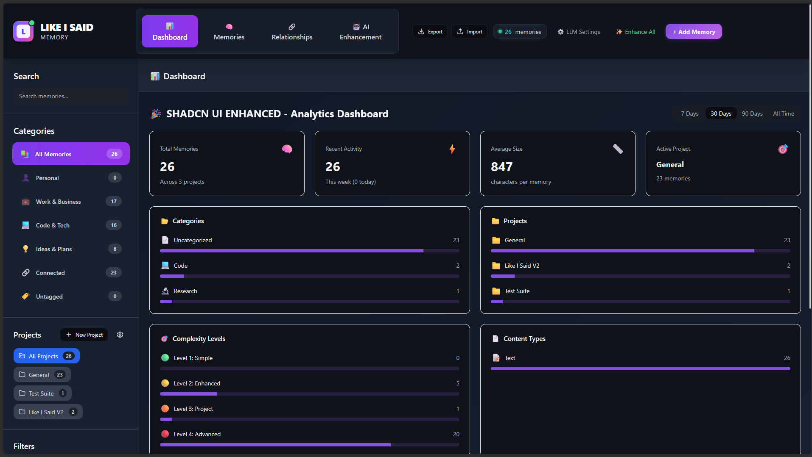
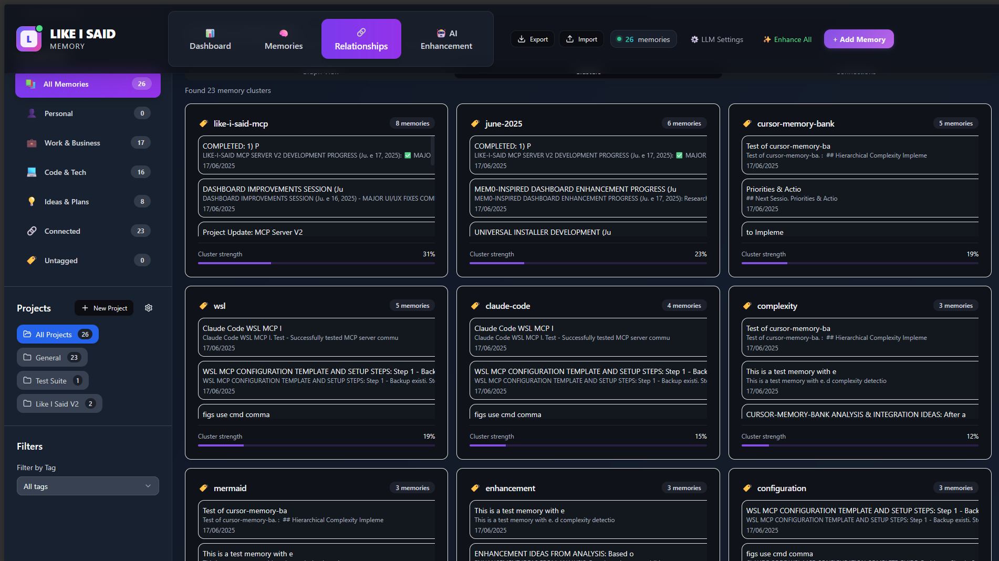

# Like-I-Said MCP v2

[](https://www.npmjs.com/package/@endlessblink/like-i-said-v2)
[](https://opensource.org/licenses/MIT)

> **MCP memory server for AI assistants** - Remember conversations across sessions

Give your AI assistants persistent memory! Store information, preferences, and context that survives conversation restarts.

## ✨ Features

- 🧠 **Persistent Memory** - AI remembers across conversations
- 🚀 **One-Command Install** - Auto-configures all AI clients
- 🌍 **Cross-Platform** - Windows, macOS, Linux (including WSL)
- 📊 **React Dashboard** - Modern web interface with real-time updates
- 🔧 **23 Powerful Tools** - Memory, task management, analytics, and AI enhancements
- 📝 **Markdown Storage** - Enhanced frontmatter with categories and relationships
- 🔍 **Advanced Search** - Full-text search with filters and tags
- 📈 **Analytics** - Memory usage statistics and insights
- 🎨 **Modern UI** - Card-based layout with dark theme

## 🚀 Installation Options

### IMPORTANT: Choose Your Installation Method

**This project supports two different types of Claude clients. Choose the method that matches your setup:**

#### 🖥️ Claude Desktop Users (Recommended)
**If you use the Claude Desktop application:**

### Option 1: Zero-Dependency DXT Installation 🎉

**NEW! Install in 30 seconds without Node.js or any technical setup!**

1. **Download**: [**⬇️ like-i-said-memory-v2.dxt**](https://github.com/endlessblink/Like-I-Said-memory-mcp-server/releases/latest/download/like-i-said-memory-v2.dxt) (1.13 MB)
2. **Open Claude Desktop Settings** → Extensions
3. **Drag & Drop** the `.dxt` file
4. **Done!** Start using all 23 tools immediately

**What DXT Provides:**
- ✅ Complete MCP server with all 23 tools
- ✅ Automatic Claude Desktop configuration
- ✅ Self-contained installation (no Node.js required)
- ✅ Secure configuration storage

[📖 DXT Installation Guide](./DXT-INSTALLATION-README.md)

---

#### 🌐 Claude Code + IDE Users
**If you use claude.ai/code with IDEs like Cursor, Windsurf, or VS Code:**

### Option 2: NPX Installation (Manual Setup Required)

**This method requires Node.js and manual configuration:**

#### Step 1: Install Node.js (First Time Only)

**For complete beginners - Node.js is like installing a program that helps run JavaScript apps on your computer.**

#### Windows Users:
1. **Visit**: [nodejs.org](https://nodejs.org) or [nodejs.org/releases](https://nodejs.org/releases) for older versions
2. **Download**: Click the green "LTS" button (Long Term Support - most stable)
3. **Install**: 
   - Run the downloaded `.msi` file
   - Click "Next" through all the steps (defaults are fine)
   - ✅ Check "Automatically install the necessary tools" if asked
4. **Verify**: 
   - Press `Windows + R`, type `cmd`, press Enter
   - Type: `node --version` and press Enter
   - You should see something like `v20.x.x`

#### Mac Users:
1. **Visit**: [nodejs.org](https://nodejs.org) or [nodejs.org/releases](https://nodejs.org/releases) for specific versions
2. **Download**: Click the green "LTS" button 
3. **Install**: 
   - Run the downloaded `.pkg` file
   - Follow the installer (defaults are fine)
4. **Verify**:
   - Press `Cmd + Space`, type `terminal`, press Enter
   - Type: `node --version` and press Enter
   - You should see something like `v20.x.x`

#### Linux Users:
```bash
# Ubuntu/Debian
curl -fsSL https://deb.nodesource.com/setup_lts.x | sudo -E bash -
sudo apt-get install -y nodejs

# Verify
node --version
```

### Step 2: One-Command MCP Installation
```bash
npx -p @endlessblink/like-i-said-v2 like-i-said-v2 install
```

**What this magical command does:**
- 🔍 **Finds your IDE apps** automatically (Cursor, Windsurf, VS Code)
- ⚙️ **Configures MCP settings** for your specific IDE
- 🧪 **Tests everything works** before finishing
- 🛡️ **Keeps your existing settings** completely safe
- 📦 **Works on all platforms** (Windows, Mac, Linux)

**Important**: This command configures your IDE to work with claude.ai/code. It does NOT configure Claude Desktop (use DXT for that).

**No coding knowledge required! Just copy, paste, and press Enter.**

### Step 3: Update to Latest Version (When Needed)
```bash
# Update to the latest version
npm update -g @endlessblink/like-i-said-v2

# Or reinstall to get latest version
npx -p @endlessblink/like-i-said-v2 like-i-said-v2 install
```

### Step 4: Start the Web Dashboard (Optional)
```bash
# Option A: Install globally (recommended for regular use)
npm install -g @endlessblink/like-i-said-v2
like-i-said-v2 start

# Option B: Run directly without installing
npx -p @endlessblink/like-i-said-v2 like-i-said-v2 start
```

**Visual Interface**: Visit `http://localhost:3001` in your browser for:
- 📊 **Memory Dashboard** - See all your AI's memories in a modern interface
- 🔍 **Advanced Search** - Find memories by content, tags, or projects  
- 📈 **Analytics** - Usage statistics and memory insights
- 🎨 **Memory Cards** - Beautiful card-based layout with categories

---

## 🔍 Which Method Should You Use?

| Your Setup | Installation Method | Why? |
|------------|-------------------|------|
| **Claude Desktop app** | DXT Installation | One-click install, automatic configuration |
| **claude.ai/code + Cursor** | NPX Installation | Manual IDE configuration required |
| **claude.ai/code + Windsurf** | NPX Installation | Manual IDE configuration required |
| **claude.ai/code + VS Code** | NPX Installation | Manual IDE configuration required |

### For Advanced Users: Docker Support
```bash
# Install with Docker configuration
npx -p @endlessblink/like-i-said-v2 like-i-said-v2 install --docker

# Or copy Docker files for custom deployment
cp docker-configs/Dockerfile.production ./Dockerfile
```

## 📸 Dashboard Screenshots

### Memory Management

*Modern card-based memory interface with search, filtering, and project organization*

### Relationship Visualization

*Interactive graph visualization showing connections between memories*

### Analytics Dashboard

*Comprehensive statistics and insights about your memory usage*

### Enhanced Features

*AI-powered memory enhancement, clustering, and advanced organization*

## 🎯 Supported AI Clients

| Client | Status | Platform |
|--------|--------|----------|
| **Claude Desktop** | ✅ Full Support | Windows, macOS, Linux |
| **Cursor** | ✅ Full Support | Windows, macOS, Linux |  
| **Windsurf** | ✅ Full Support | Windows, macOS, Linux |
| **Claude Code (VS Code)** | ✅ Full Support | Windows, macOS, Linux |
| **Continue** | ✅ Full Support | Windows, macOS, Linux |
| **Zed Editor** | ✅ Full Support | Windows, macOS, Linux |

## 🛠️ Available Tools

After installation, your AI assistant will have these tools:

- **`add_memory`** - Store information with tags, categories, and project context
- **`get_memory`** - Retrieve specific memory by ID
- **`list_memories`** - Show memories with complexity levels and metadata
- **`delete_memory`** - Remove specific memory
- **`search_memories`** - Full-text search with project filtering
- **`test_tool`** - Verify MCP connection

### Enhanced Memory Features:
- **Categories**: personal, work, code, research, conversations, preferences
- **Complexity Levels**: L1 (Simple) → L4 (Advanced)
- **Projects**: Organize memories by project context
- **Relationships**: Link related memories together

## 📋 Usage Examples

**Store a preference:**
> "Remember that I prefer TypeScript over JavaScript for new projects"

**Recall information:**  
> "What did I tell you about my TypeScript preference?"

**Project context:**
> "Store that this React app uses Tailwind CSS and shadcn/ui components"

**Search memories:**
> "Find all memories about React projects"

## 🔧 Advanced Setup

### Custom Installation
```bash
npx -p @endlessblink/like-i-said-v2 like-i-said-v2 init
```


### Manual Server Start
```bash
npx -p @endlessblink/like-i-said-v2 like-i-said-v2 start
```

## 🔄 After Installation

1. **Restart your AI client:**
   - **Claude Desktop**: Close completely and restart
   - **Cursor**: Press `Ctrl+Shift+P` → "Reload Window"
   - **Windsurf**: Auto-detects changes

2. **Test the installation:**
   > "What MCP tools do you have available?"

3. **Start using memory:**
   > "Remember that I'm working on a Next.js project called MyApp"

## 🆘 Troubleshooting

### Tools don't appear?
- Ensure you fully restarted your AI client
- Wait 2-3 minutes for detection (Claude Desktop may take up to 5 minutes)
- Check client-specific logs

### Windows-specific notes:
- ⚠️ **Always use the full npx command format**: `npx -p @endlessblink/like-i-said-v2 like-i-said-v2 install`
- The simplified `npx @endlessblink/like-i-said-v2 install` will NOT work on Windows
- For PowerShell issues, try: `cmd /c "npx -p @endlessblink/like-i-said-v2 like-i-said-v2 install"`

### Config locations:
- **Claude Desktop**: 
  - Windows: `%APPDATA%\Claude\claude_desktop_config.json`
  - macOS: `~/Library/Application Support/Claude/claude_desktop_config.json`
  - Linux: `~/.config/Claude/claude_desktop_config.json`
- **Cursor**: 
  - Windows: `%USERPROFILE%\.cursor\mcp.json`
  - macOS/Linux: `~/.cursor/mcp.json`
- **Windsurf**: 
  - Windows: `%USERPROFILE%\.codeium\windsurf\mcp_config.json`
  - macOS/Linux: `~/.codeium/windsurf/mcp_config.json`

### Reset installation:
```bash
npx -p @endlessblink/like-i-said-v2 like-i-said-v2 install
```

## 🔨 Development Setup

If you want to run from source:

```bash
# Clone the repository
git clone https://github.com/endlessblink/Like-I-Said-memory-mcp-server.git
cd Like-I-Said-memory-mcp-server

# Install dependencies
npm install

# Run development servers
npm run dev:full    # Start both API and React dashboard
npm run dev         # React dashboard only
npm run dashboard   # API server only

# Build for production
npm run build
```

## 📊 Memory Storage

- **Format**: Markdown files with enhanced frontmatter
- **Location**: `memories/` directory organized by project
- **Structure**: 145+ memories with complexity levels, categories, and relationships
- **Features**: Real-time file watching, automatic indexing
- **API**: RESTful API on port 3001 for dashboard integration

## 🤝 Contributing

Found a bug or want to contribute?
- **Issues**: [GitHub Issues](https://github.com/endlessblink/Like-I-Said-memory-mcp-server/issues)
- **Repository**: [GitHub](https://github.com/endlessblink/Like-I-Said-memory-mcp-server)

## 📜 License

MIT License - see LICENSE file for details.

---

**Made for AI enthusiasts who want their assistants to remember! 🧠✨**
