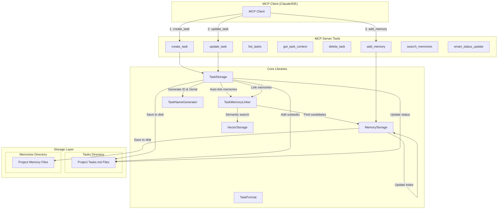
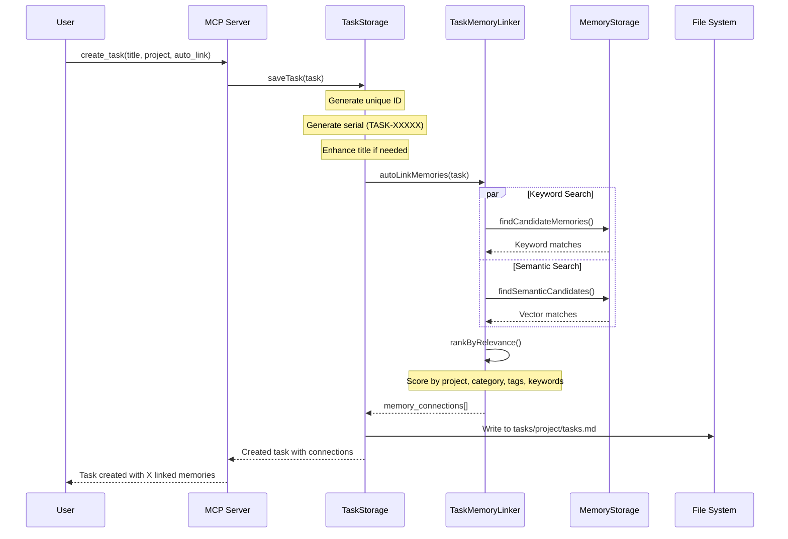
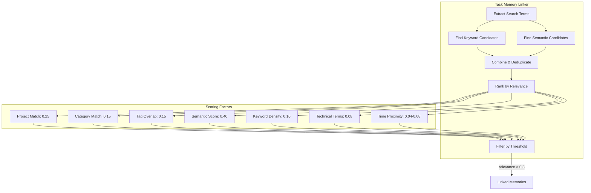
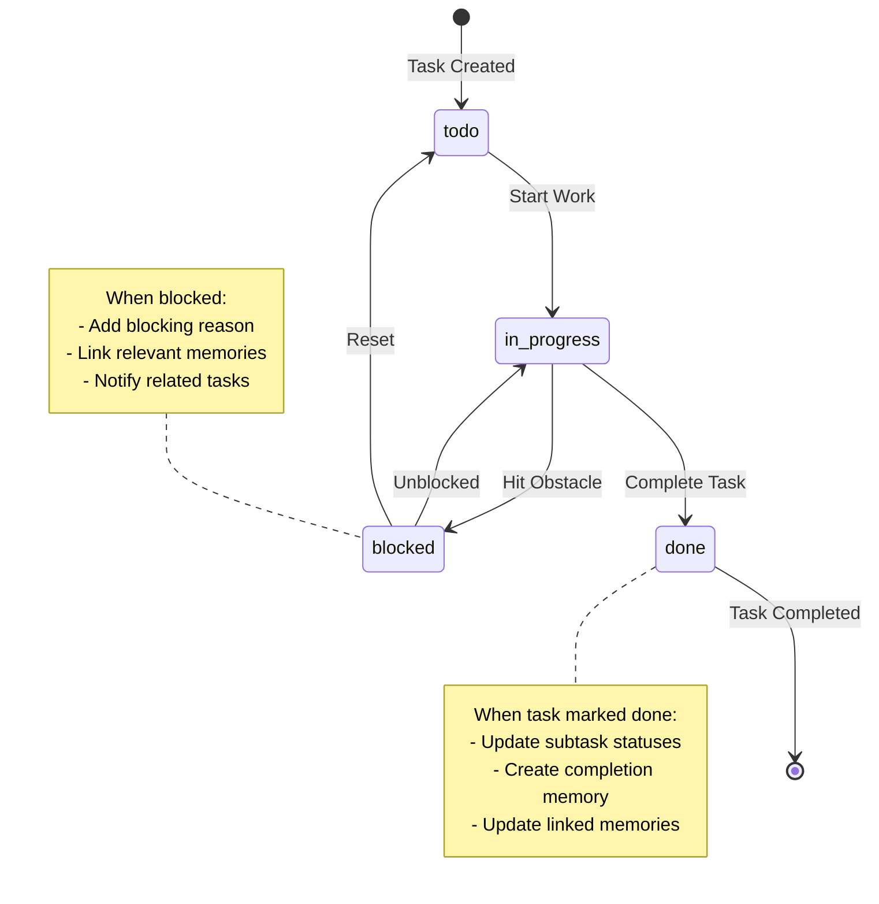

# Task-Subtask-Memory Workflow in Like-I-Said MCP Server

## Overview
This document provides a detailed diagram and explanation of how main tasks, subtasks, and memories interact within the Like-I-Said MCP server system.

## System Architecture Diagram



## Detailed Process Flow

### 1. Task Creation Workflow



### 2. Subtask Management Workflow

```mermaid
flowchart LR
    subgraph "Main Task"
        MT[Main Task<br/>ID: task-2025-01-31-abc123<br/>Status: in_progress]
    end
    
    subgraph "Subtasks Array"
        ST1[Subtask 1 ID]
        ST2[Subtask 2 ID]
        ST3[Subtask 3 ID]
    end
    
    subgraph "Actual Subtasks"
        AST1[Task: Implement API<br/>parent_task: abc123<br/>Status: done]
        AST2[Task: Add Tests<br/>parent_task: abc123<br/>Status: in_progress]
        AST3[Task: Update Docs<br/>parent_task: abc123<br/>Status: todo]
    end
    
    MT -->|subtasks[]| ST1
    MT -->|subtasks[]| ST2
    MT -->|subtasks[]| ST3
    
    ST1 -.->|references| AST1
    ST2 -.->|references| AST2
    ST3 -.->|references| AST3
    
    AST1 -->|parent_task| MT
    AST2 -->|parent_task| MT
    AST3 -->|parent_task| MT
```

### 3. Memory Linking Process



### 4. Task Status Workflow



## Data Structures

### Task Structure
```yaml
---
id: task-2025-01-31-abc123
serial: TASK-00042
title: Enhanced task title
description: Detailed description
project: my-project
category: code
priority: high
status: in_progress
parent_task: null
tags: [api, backend]
subtasks: [task-2025-01-31-def456, task-2025-01-31-ghi789]
memory_connections:
  - memory_id: mem-123
    memory_serial: MEM-123456
    connection_type: research
    relevance: 0.85
    matched_terms: [api, backend]
  - memory_id: mem-456
    memory_serial: MEM-789012
    connection_type: implementation
    relevance: 0.72
    matched_terms: [project:my-project]
manual_memories: [mem-789]
created: 2025-01-31T10:00:00Z
updated: 2025-01-31T11:30:00Z
---
```

### Memory Structure
```yaml
---
id: mem-123
timestamp: 2025-01-30T15:00:00Z
complexity: 3
category: code
project: my-project
tags: [api, solution, backend]
priority: high
status: active
related_memories: [mem-456, mem-789]
task_connections:
  - task_id: task-2025-01-31-abc123
    task_serial: TASK-00042
    connection_type: research
    created: 2025-01-31T10:00:00Z
access_count: 5
last_accessed: 2025-01-31T11:00:00Z
metadata:
  content_type: code
  language: javascript
  size: 2048
  mermaid_diagram: false
---
Memory content goes here...
```

## Key Features

### 1. Automatic Memory Linking
- **Keyword Matching**: Searches for common terms between tasks and memories
- **Semantic Search**: Uses vector embeddings for conceptual similarity
- **Project Context**: Prioritizes memories from the same project
- **Category Alignment**: Matches tasks with memories of the same category
- **Tag Overlap**: Calculates similarity based on shared tags
- **Time Proximity**: Considers recent memories more relevant

### 2. Bidirectional Connections
- Tasks store `memory_connections[]` with relevance scores
- Memories store `task_connections[]` for reverse lookup
- Both updated automatically during linking process

### 3. Subtask Management
- Subtasks are full tasks with `parent_task` reference
- Parent tasks maintain `subtasks[]` array of IDs
- Status updates can cascade (optional)
- Subtasks inherit project and category from parent

### 4. Smart Status Updates
- Natural language processing for status changes
- Automatic validation of status transitions
- Creation of completion memories when tasks finish
- Workflow automation suggestions

## Common Operations

### Creating a Task with Auto-Linking
```javascript
// MCP Tool Call
create_task({
  title: "Implement user authentication API",
  project: "my-app",
  category: "code",
  priority: "high",
  auto_link: true,  // Enable automatic memory linking
  manual_memories: ["mem-789"]  // Optional manual connections
})
```

### Adding Subtasks
```javascript
// MCP Tool Call
update_task({
  task_id: "task-2025-01-31-abc123",
  add_subtasks: [
    "Create JWT token generation",
    "Add password hashing",
    "Implement session management"
  ]
})
```

### Getting Full Task Context
```javascript
// MCP Tool Call
get_task_context({
  task_id: "task-2025-01-31-abc123",
  depth: "deep"  // Include related tasks and their memories
})
```

## Performance Considerations

1. **Memory Index**: In-memory map for O(1) task lookups
2. **File-Based Storage**: Markdown files organized by project
3. **Lazy Loading**: Memories loaded on demand
4. **Relevance Threshold**: Only memories with >0.3 relevance linked
5. **Connection Limit**: Maximum 5 auto-linked memories per task

## Best Practices

1. **Use Projects**: Always specify a project for better organization
2. **Add Tags**: Tags improve memory discovery and linking
3. **Clear Titles**: Descriptive titles help with auto-linking
4. **Manual Override**: Use `manual_memories` for critical connections
5. **Status Updates**: Keep task status current for accurate analytics
6. **Subtask Granularity**: Break complex tasks into manageable subtasks

This workflow ensures efficient task management with intelligent memory connections, enabling better context retention and knowledge reuse across sessions.