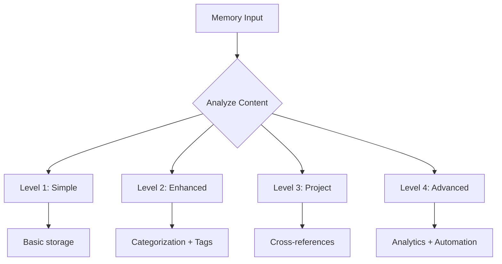

---
id: 1750186047370u8zcyudm3
timestamp: 2025-06-17T18:47:27.370Z
complexity: 4
category: code
project: like-i-said-v2
tags: ["cursor-memory-bank", "integration", "complexity", "mermaid", "implementation", "complete"]
priority: high
status: active
related_memories: ["1750185705840kjqd9zx48"]
access_count: 0
last_accessed: 2025-06-17T18:47:27.370Z
metadata:
  content_type: code
  language: mermaid
  size: 615
  mermaid_diagram: true
---Test of cursor-memory-bank integration:

## Hierarchical Complexity Implementation Complete

Complexity features working:
- ✅ Enhanced frontmatter structure
- ✅ Automatic complexity detection
- ✅ Content type analysis
- ✅ Mermaid diagram detection
- ✅ Project organization
- ✅ Metadata tracking