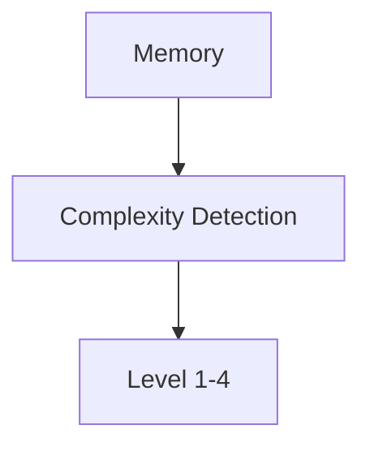

---
id: 1750185705840kjqd9zx48
timestamp: 2025-06-17T18:41:45.840Z
complexity: 4
category: code
project: like-i-said-v2
tags: ["test", "complexity", "enhancement", "markdown", "code", "mermaid"]
priority: high
status: active
access_count: 0
last_accessed: 2025-06-17T18:41:45.840Z
metadata:
  content_type: code
  language: javascript
  size: 312
  mermaid_diagram: true
---This is a test memory with enhanced frontmatter and complexity detection. It includes code examples:

```javascript
function detectComplexity(memory) {
  return memory.tags.length > 5 ? 4 : 1;
}
```

And some mermaid diagrams:

