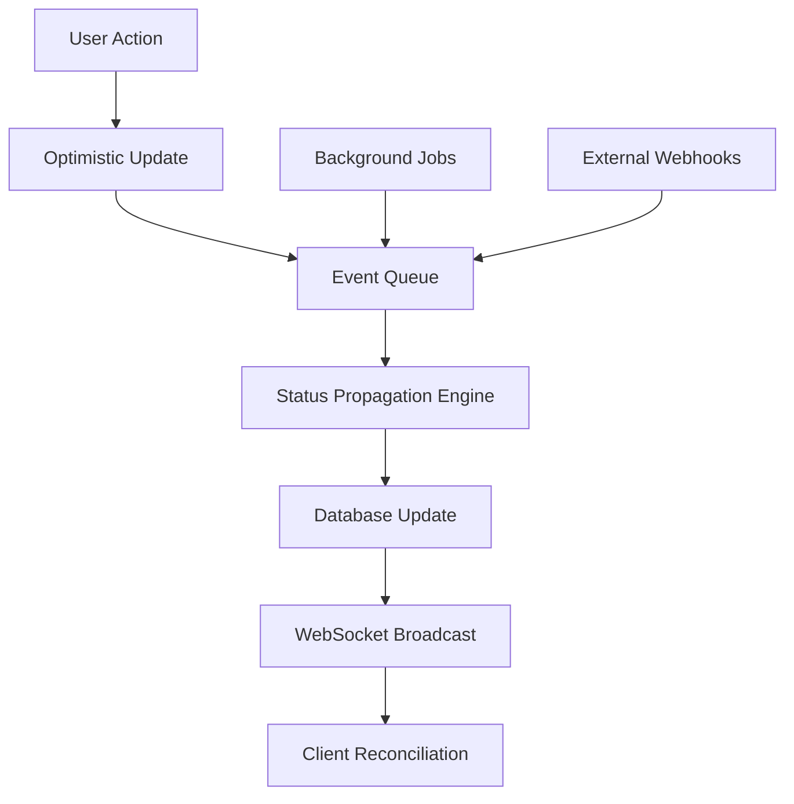
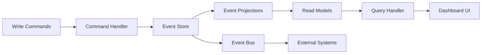
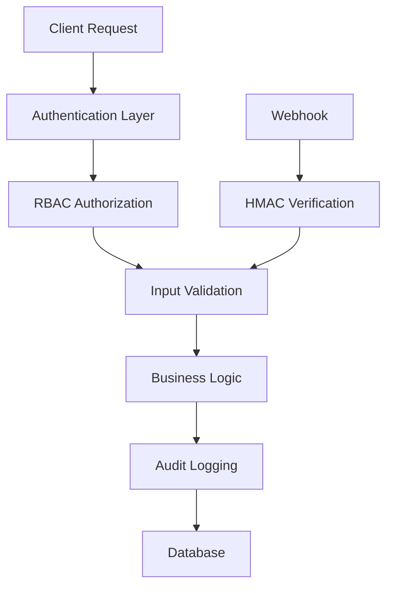

# 🏗️ Like-I-Said MCP Server v3 - Master Task List Implementation Plan
## Enterprise-Grade Hierarchical Project Management System

**Goal**: Transform Like-I-Said into a comprehensive, AI-powered project management system with intelligent task hierarchies, real-time collaboration, and enterprise-grade reliability.

**Architecture**: Event-driven, CQRS-based system with zero-downtime migrations and horizontal scalability.

---

## 🚨 CRITICAL DESIGN PRINCIPLES & ARCHITECTURE

### **Design Philosophy**
- **User-Initiated**: Master tasks created only when user explicitly requests project planning
- **Enterprise-Grade**: Security, compliance, accessibility, and performance at scale
- **Event-Driven**: Asynchronous propagation prevents performance bottlenecks
- **Zero-Downtime**: All migrations and updates maintain system availability
- **AI-Enhanced**: Transparent, auditable intelligence with model governance

### **Core Technical Architecture**

#### **Event-Driven Status Propagation**
```javascript
// Replace synchronous updates with event queue
StatusUpdateEvent {
  taskId: string,
  oldStatus: TaskStatus,
  newStatus: TaskStatus,
  timestamp: Date,
  propagationDepth: number, // Prevent infinite loops
  transactionId: string     // For rollback capability
}
```

#### **CQRS Data Pattern**
```javascript
// Separate read/write models for performance
CommandModel: {
  // Write operations - optimized for consistency
  createTask(), updateStatus(), addDependency()
}

ReadModel: {
  // Read operations - optimized for query performance
  getHierarchy(), calculateProgress(), getDependencyGraph()
}
```

#### **Hybrid Data Structure**
```sql
-- Materialized path for fast "get all descendants"
-- + Adjacency list for precise updates
tasks {
  id: uuid PRIMARY KEY,
  hierarchy_path: text,     -- "/master/phase1/task3"
  parent_id: uuid REFERENCES tasks(id),
  depth_level: integer,
  // ... other fields
}

-- Separate junction tables for relationships
task_dependencies {
  id: uuid PRIMARY KEY,
  dependent_task_id: uuid REFERENCES tasks(id),
  dependency_task_id: uuid REFERENCES tasks(id),
  dependency_type: enum('blocks', 'enables', 'informs'),
  created_at: timestamp
}
```

### **Success Metrics & KPIs**
| Metric | Target | Rationale |
|--------|--------|-----------|
| Master task adoption (≥5 tasks) | 70% | Realistic first-year adoption |
| Status propagation latency | 150ms P99 | Allows event queue headroom |
| Dashboard load (200+ tasks) | 2.5s | With virtualization & HTTP/2 |
| Template learning accuracy | 80% precision, 70% recall | Measurable AI quality |
| System availability | 99.9% | Enterprise SLA requirement |

---

## 📋 IMPLEMENTATION PHASES

## **PHASE 1: CORE HIERARCHY SYSTEM** 
*Estimated Time: 20-25 hours*

### ✅ **Task 1.1: Data Model & Migration Foundation**
**Priority**: CRITICAL | **Estimated**: 6-8 hours
- [ ] **Schema Design with Normalization**
  ```javascript
  // Enhanced task schema
  {
    // Core fields
    id: uuid,
    taskType: "regular" | "master" | "phase" | "milestone",
    masterLevel: 0 | 1 | 2 | 3 | 4,
    
    // Hierarchy (hybrid approach)
    hierarchyPath: string,        // Materialized path: "/master/phase1/task3"
    parentId: uuid | null,        // Adjacency list
    depthLevel: integer,          // Cached depth for queries
    
    // Time tracking
    timeEstimate: number | null,   // Estimated hours
    actualTime: number | null,     // Actual hours spent
    
    // Metadata
    templateId: uuid | null,
    completionPercentage: number,  // Weighted by estimates
    
    // Audit trail
    createdAt: timestamp,
    updatedAt: timestamp,
    createdBy: string,
    lastModifiedBy: string
  }
  ```

- [ ] **Zero-Downtime Migration Strategy**
  ```sql
  -- Phase 1: Add new columns with defaults
  ALTER TABLE tasks ADD COLUMN hierarchy_path TEXT DEFAULT '';
  ALTER TABLE tasks ADD COLUMN master_level INTEGER DEFAULT 0;
  
  -- Phase 2: Backfill asynchronously
  -- Phase 3: Create indexes
  -- Phase 4: Flip feature flags
  -- Phase 5: Deprecate old columns after validation
  ```

- [ ] **Junction Tables for Performance**
  ```sql
  -- Normalize dependencies to reduce JSON bloat
  CREATE TABLE task_dependencies (
    id UUID PRIMARY KEY,
    dependent_task_id UUID REFERENCES tasks(id) ON DELETE CASCADE,
    dependency_task_id UUID REFERENCES tasks(id) ON DELETE CASCADE,
    dependency_type VARCHAR(20) NOT NULL,
    created_at TIMESTAMP DEFAULT NOW(),
    UNIQUE(dependent_task_id, dependency_task_id)
  );
  
  CREATE INDEX idx_task_deps_dependent ON task_dependencies(dependent_task_id);
  CREATE INDEX idx_task_deps_dependency ON task_dependencies(dependency_task_id);
  ```

**Files to Create/Modify**:
- `/lib/task-format.js` - Enhanced schema
- `/lib/migration-v3.js` - Zero-downtime migration
- `/scripts/backfill-hierarchy.js` - Async data migration
- `/lib/schema-validator.js` - Validation rules

### ✅ **Task 1.2: Event-Driven Status Propagation**
**Priority**: CRITICAL | **Estimated**: 5-6 hours
- [ ] **Event Queue Architecture**
  ```javascript
  // Event-driven propagation prevents lock contention
  class StatusPropagationEngine {
    constructor(eventQueue) {
      this.queue = eventQueue; // RabbitMQ or Redis Streams
      this.maxDepth = 10;      // Prevent infinite loops
    }
    
    async propagateStatusChange(event) {
      // Debounce rapid updates
      const debounced = await this.debounceUpdates(event);
      
      // Process in batches to prevent overwhelming
      const affectedTasks = await this.getAffectedParents(event.taskId);
      await this.queue.publishBatch(affectedTasks.map(task => ({
        ...event,
        taskId: task.id,
        propagationDepth: event.propagationDepth + 1
      })));
    }
  }
  ```

- [ ] **Optimistic Updates with Rollback**
  ```javascript
  // Frontend optimistic updates with server reconciliation
  class OptimisticUpdateManager {
    pendingUpdates = new Map(); // transactionId -> update
    
    async updateTaskStatus(taskId, newStatus) {
      const transactionId = uuid();
      
      // 1. Immediate UI update
      this.applyOptimisticUpdate(taskId, newStatus, transactionId);
      
      try {
        // 2. Server update
        await this.api.updateTask(taskId, { status: newStatus });
        this.commitTransaction(transactionId);
      } catch (error) {
        // 3. Rollback on failure
        this.rollbackTransaction(transactionId);
        this.showError("Update failed: " + error.message);
      }
    }
  }
  ```

**Files to Create**:
- `/lib/event-propagation-engine.js` - Core propagation logic
- `/lib/optimistic-update-manager.js` - Client-side updates
- `/lib/event-queue-adapter.js` - Queue abstraction layer

### ✅ **Task 1.3: Cycle Detection & Validation**
**Priority**: HIGH | **Estimated**: 3-4 hours
- [ ] **Tarjan's Algorithm Implementation**
  ```javascript
  // Strongly connected components for cycle detection
  class DependencyGraphValidator {
    detectCycles(tasks, dependencies) {
      const graph = this.buildAdjacencyList(tasks, dependencies);
      const scc = this.tarjanSCC(graph);
      
      // Any SCC with > 1 node indicates a cycle
      return scc.filter(component => component.length > 1);
    }
    
    tarjanSCC(graph) {
      // Tarjan's strongly connected components algorithm
      // Returns array of strongly connected components
    }
    
    validateDependencyAddition(fromTaskId, toTaskId) {
      // Check if adding this dependency would create a cycle
      const wouldCreateCycle = this.wouldCreateCycle(fromTaskId, toTaskId);
      if (wouldCreateCycle) {
        throw new ValidationError(`Adding dependency would create cycle`);
      }
    }
  }
  ```

**Files to Create**:
- `/lib/dependency-graph-validator.js` - Cycle detection
- `/lib/graph-algorithms.js` - Tarjan's implementation

### ✅ **Task 1.4: Enhanced MCP Tools**
**Priority**: HIGH | **Estimated**: 6-7 hours
- [ ] **Master Task Creation with Preview**
  ```javascript
  // create_master_task with comprehensive preview
  async function createMasterTask({
    title,
    project,
    description,
    analyzeExisting = true,
    previewMode = true
  }) {
    // 1. Analyze existing memories and tasks
    const analysis = await this.projectAnalyzer.analyze(project);
    
    // 2. Generate suggested hierarchy
    const suggestedHierarchy = await this.generateHierarchy(analysis);
    
    if (previewMode) {
      // 3. Return preview for user approval
      return {
        type: 'preview',
        suggestedHierarchy,
        existingTasksToAdopt: analysis.orphanedTasks,
        estimatedCompletion: analysis.estimatedHours,
        risks: analysis.identifiedRisks
      };
    }
    
    // 4. Create actual hierarchy after approval
    return await this.createHierarchyFromPreview(suggestedHierarchy);
  }
  ```

- [ ] **Intelligent Project Analysis**
  ```javascript
  // generate_project_plan with AI assistance
  async function generateProjectPlan({
    project,
    analysisDepth = "deep",
    includeMemories = true,
    templateSuggestions = true
  }) {
    const context = {
      existingTasks: await this.getProjectTasks(project),
      memories: includeMemories ? await this.getProjectMemories(project) : [],
      similarProjects: await this.findSimilarProjects(project)
    };
    
    // AI-powered analysis with explainability
    const analysis = await this.aiAnalyzer.analyzeProject(context, {
      depth: analysisDepth,
      explainReasoning: true,
      confidence: 0.8
    });
    
    return {
      suggestedPhases: analysis.phases,
      missingTasks: analysis.gaps,
      recommendedTemplates: templateSuggestions ? analysis.templates : [],
      reasoning: analysis.explanation,
      confidence: analysis.confidence
    };
  }
  ```

**Files to Create**:
- `/lib/master-task-tools.js` - Enhanced MCP tools
- `/lib/project-analyzer.js` - AI-powered analysis
- `/lib/hierarchy-generator.js` - Structure generation

---

## **PHASE 2: AI INTELLIGENCE & TEMPLATE SYSTEM**
*Estimated Time: 22-28 hours*

### ✅ **Task 2.1: Model Governance & Explainability**
**Priority**: HIGH | **Estimated**: 6-8 hours
- [ ] **Model Registry & Version Control**
  ```javascript
  // Lock model versions for deterministic inference
  class ModelRegistry {
    constructor() {
      this.models = new Map();
      this.versionHistory = new Map();
    }
    
    registerModel(name, version, modelDigest, config) {
      const modelKey = `${name}:${version}`;
      this.models.set(modelKey, {
        digest: modelDigest,        // SHA256 of model weights
        config,
        deployedAt: new Date(),
        commitSHA: process.env.GIT_COMMIT,
        performanceMetrics: {}
      });
    }
    
    async predict(modelName, version, input) {
      const model = this.getModel(modelName, version);
      const result = await model.predict(input);
      
      // Include explainability
      return {
        prediction: result.output,
        confidence: result.confidence,
        reasoning: result.topTokens, // Top-n rationale tokens
        modelVersion: version,
        timestamp: new Date()
      };
    }
  }
  ```

- [ ] **Explainable AI Layer**
  ```javascript
  // Surface reasoning for user trust
  class ExplainableProjectAnalyzer {
    async analyzeProject(context) {
      const analysis = await this.model.analyze(context);
      
      return {
        suggestions: analysis.suggestions,
        reasoning: {
          keySignals: analysis.topTokens,     // ["deadline", "PRD", "Sprint 2"]
          confidence: analysis.confidence,     // 0.0 - 1.0
          dataPoints: analysis.evidenceUsed,  // Which memories/tasks influenced decision
          alternatives: analysis.alternatives  // Other options considered
        }
      };
    }
  }
  ```

- [ ] **Accuracy Benchmarking**
  ```javascript
  // Continuous model performance monitoring
  class ModelPerformanceTracker {
    async trackPrediction(modelName, prediction, actualOutcome) {
      const metrics = {
        precision: await this.calculatePrecision(prediction, actualOutcome),
        recall: await this.calculateRecall(prediction, actualOutcome),
        userSatisfaction: await this.getUserFeedback(prediction.id)
      };
      
      // Alert if metrics drop below threshold
      if (metrics.precision < 0.80 || metrics.recall < 0.70) {
        await this.alertModelDegradation(modelName, metrics);
      }
    }
  }
  ```

**Files to Create**:
- `/lib/model-registry.js` - Model version management
- `/lib/explainable-ai.js` - Reasoning layer
- `/lib/model-performance.js` - Accuracy tracking

### ✅ **Task 2.2: Advanced Template System**
**Priority**: HIGH | **Estimated**: 8-10 hours
- [ ] **Template Versioning & Diffing**
  ```javascript
  // JSON-patch based template versioning
  class TemplateVersionManager {
    async createTemplate(template) {
      const templateId = uuid();
      const version = "1.0.0";
      
      await this.storage.save({
        id: templateId,
        version,
        content: template,
        createdAt: new Date(),
        patches: [] // JSON-patch history
      });
      
      return { templateId, version };
    }
    
    async updateTemplate(templateId, changes) {
      const current = await this.storage.get(templateId);
      const patch = jsonpatch.compare(current.content, changes);
      
      const newVersion = this.incrementVersion(current.version);
      await this.storage.save({
        ...current,
        version: newVersion,
        content: changes,
        patches: [...current.patches, {
          version: newVersion,
          patch,
          timestamp: new Date(),
          author: getCurrentUser()
        }]
      });
      
      return { version: newVersion, patch };
    }
    
    async getDiff(templateId, fromVersion, toVersion) {
      // Show human-readable diff between versions
      const template = await this.storage.get(templateId);
      const relevantPatches = template.patches.filter(p => 
        this.isVersionBetween(p.version, fromVersion, toVersion)
      );
      
      return this.generateDiffView(relevantPatches);
    }
  }
  ```

- [ ] **Template Marketplace with Guardrails**
  ```javascript
  // Automated template validation
  class TemplateValidator {
    validate(template) {
      const errors = [];
      
      // Field completeness check
      if (!template.title || !template.description) {
        errors.push("Missing required fields: title, description");
      }
      
      // Hierarchy depth validation
      const maxDepth = this.calculateMaxDepth(template.tasks);
      if (maxDepth > 4) {
        errors.push(`Template exceeds maximum depth of 4 (found: ${maxDepth})`);
      }
      
      // Dependency cycle detection
      const cycles = this.detectCycles(template.tasks, template.dependencies);
      if (cycles.length > 0) {
        errors.push(`Template contains dependency cycles: ${cycles.join(', ')}`);
      }
      
      // Security scan for malicious content
      const securityIssues = this.scanForMaliciousContent(template);
      errors.push(...securityIssues);
      
      return {
        valid: errors.length === 0,
        errors,
        warnings: this.generateWarnings(template)
      };
    }
  }
  ```

- [ ] **Pattern Learning System**
  ```javascript
  // Extract reusable patterns from successful projects
  class TemplatePatternLearner {
    async analyzeCompletedProjects() {
      const completedProjects = await this.getCompletedProjects();
      const patterns = [];
      
      for (const project of completedProjects) {
        // Extract structural patterns
        const structure = this.extractStructure(project);
        const timing = this.extractTimingPatterns(project);
        const dependencies = this.extractDependencyPatterns(project);
        
        patterns.push({
          projectType: this.classifyProject(project),
          structure,
          timing,
          dependencies,
          successMetrics: project.completionStats
        });
      }
      
      // Cluster similar patterns into template candidates
      const templateCandidates = this.clusterPatterns(patterns);
      
      return templateCandidates.map(cluster => ({
        suggestedTemplate: this.generateTemplate(cluster),
        confidence: cluster.confidence,
        basedOnProjects: cluster.projects.length,
        averageSuccess: cluster.avgSuccessRate
      }));
    }
  }
  ```

**Files to Create**:
- `/lib/template-version-manager.js` - Versioning system
- `/lib/template-validator.js` - Validation & security
- `/lib/template-pattern-learner.js` - Pattern extraction
- `/data/templates/` - Template storage

### ✅ **Task 2.3: Cross-Project Intelligence**
**Priority**: MEDIUM | **Estimated**: 4-5 hours
- [ ] **Project Similarity Detection**
  ```javascript
  // Find similar projects for template suggestions
  class ProjectSimilarityEngine {
    async findSimilarProjects(targetProject, limit = 5) {
      const allProjects = await this.getAllProjects();
      const similarities = [];
      
      for (const project of allProjects) {
        const similarity = await this.calculateSimilarity(targetProject, project);
        similarities.push({ project, similarity });
      }
      
      return similarities
        .sort((a, b) => b.similarity - a.similarity)
        .slice(0, limit);
    }
    
    async calculateSimilarity(project1, project2) {
      // Multi-factor similarity calculation
      const titleSimilarity = this.calculateTextSimilarity(
        project1.title, project2.title
      );
      const tagSimilarity = this.calculateSetSimilarity(
        project1.tags, project2.tags
      );
      const structureSimilarity = this.calculateStructureSimilarity(
        project1.hierarchy, project2.hierarchy
      );
      
      // Weighted combination
      return (
        titleSimilarity * 0.3 +
        tagSimilarity * 0.4 +
        structureSimilarity * 0.3
      );
    }
  }
  ```

- [ ] **Cross-Project Dependencies**
  ```javascript
  // Enable dependencies across project boundaries
  class CrossProjectDependencyManager {
    async createCrossProjectDependency(fromTask, toTask) {
      // Validate both tasks exist and user has permissions
      await this.validateCrossProjectAccess(fromTask.project, toTask.project);
      
      // Create dependency with project context
      const dependency = {
        id: uuid(),
        dependentTask: fromTask.id,
        dependencyTask: toTask.id,
        type: 'cross_project',
        fromProject: fromTask.project,
        toProject: toTask.project,
        createdAt: new Date(),
        notifications: {
          onStatusChange: true,
          onCompletion: true
        }
      };
      
      await this.storage.saveDependency(dependency);
      
      // Set up cross-project notifications
      await this.setupCrossProjectNotifications(dependency);
      
      return dependency;
    }
  }
  ```

**Files to Create**:
- `/lib/project-similarity-engine.js` - Similarity detection
- `/lib/cross-project-manager.js` - Cross-project features

### ✅ **Task 2.4: Enhanced Progress Tracking**
**Priority**: MEDIUM | **Estimated**: 4-5 hours
- [ ] **Weighted Progress Calculation**
  ```javascript
  // Mathematically sound progress calculation
  class ProgressCalculator {
    calculateHierarchyProgress(masterTask) {
      const children = masterTask.children;
      
      if (children.length === 0) {
        return masterTask.completed ? 100 : 0;
      }
      
      // Weighted by time estimates
      const totalWeight = children.reduce((sum, child) => 
        sum + (child.timeEstimate || 1), 0
      );
      
      const weightedProgress = children.reduce((sum, child) => {
        const weight = (child.timeEstimate || 1) / totalWeight;
        const childProgress = this.calculateHierarchyProgress(child);
        return sum + (weight * childProgress);
      }, 0);
      
      return Math.round(weightedProgress * 100) / 100; // 2 decimal places
    }
    
    getProgressDisplay(progress, hasEstimates) {
      // Display "~65%" for non-estimated items to avoid false precision
      const prefix = hasEstimates ? "" : "~";
      return `${prefix}${progress}%`;
    }
  }
  ```

**Files to Create**:
- `/lib/progress-calculator.js` - Progress mathematics
- `/lib/time-estimation.js` - Time tracking utilities

---

## **PHASE 3: DASHBOARD INTEGRATION & UI**
*Estimated Time: 18-24 hours*

### ✅ **Task 3.1: Performance-Optimized React Components**
**Priority**: HIGH | **Estimated**: 8-10 hours
- [ ] **Virtualized Hierarchy Tree**
  ```tsx
  // Use react-window for large hierarchies
  import { FixedSizeTree as Tree } from 'react-vtree';
  
  interface HierarchyTreeProps {
    tasks: HierarchicalTask[];
    onTaskClick: (task: Task) => void;
    maxHeight: number;
  }
  
  export const HierarchyTree: React.FC<HierarchyTreeProps> = ({
    tasks,
    onTaskClick,
    maxHeight
  }) => {
    const treeWalker = useMemo(() => {
      return createTreeWalker(tasks, {
        // Only render visible nodes
        getChildren: (node) => node.children,
        isOpenByDefault: (node) => node.level < 2 // Auto-expand first 2 levels
      });
    }, [tasks]);
    
    const Node = ({ data, isOpen, style, toggle }) => (
      <div style={style} className="tree-node">
        <TaskCard 
          task={data.task}
          level={data.level}
          isExpanded={isOpen}
          onToggle={toggle}
          onClick={() => onTaskClick(data.task)}
        />
      </div>
    );
    
    return (
      <Tree
        treeWalker={treeWalker}
        height={maxHeight}
        width="100%"
        itemSize={60} // Height per row
      >
        {Node}
      </Tree>
    );
  };
  ```

- [ ] **Master Task Card with Progress Visualization**
  ```tsx
  // Enterprise-grade task card component
  interface MasterTaskCardProps {
    task: MasterTask;
    showHierarchy?: boolean;
    onStatusChange: (taskId: string, status: TaskStatus) => void;
  }
  
  export const MasterTaskCard: React.FC<MasterTaskCardProps> = ({
    task,
    showHierarchy = true,
    onStatusChange
  }) => {
    const progress = useProgressCalculation(task);
    const [optimisticStatus, setOptimisticStatus] = useState(task.status);
    
    const handleStatusChange = async (newStatus: TaskStatus) => {
      // Optimistic update
      setOptimisticStatus(newStatus);
      
      try {
        await onStatusChange(task.id, newStatus);
      } catch (error) {
        // Rollback on failure
        setOptimisticStatus(task.status);
        toast.error(`Failed to update status: ${error.message}`);
      }
    };
    
    return (
      <Card className="master-task-card">
        <CardHeader>
          <div className="flex items-center gap-2">
            <TaskTypeIcon type={task.taskType} />
            <h3 className="font-semibold">{task.title}</h3>
            <StatusBadge 
              status={optimisticStatus} 
              onChange={handleStatusChange}
              disabled={task.blockedBy.length > 0}
            />
          </div>
        </CardHeader>
        
        <CardContent>
          <ProgressBar 
            value={progress.percentage}
            showEstimate={progress.hasEstimates}
            className="mb-4"
          />
          
          <div className="flex justify-between text-sm text-gray-600">
            <span>⏱️ Est: {task.timeEstimate || '?'}h | Actual: {task.actualTime || 0}h</span>
            <span>{progress.completedTasks}/{progress.totalTasks} tasks</span>
          </div>
          
          {showHierarchy && task.children.length > 0 && (
            <CollapsibleHierarchy 
              tasks={task.children}
              level={1}
              maxLevel={3}
            />
          )}
        </CardContent>
      </Card>
    );
  };
  ```

- [ ] **Accessibility Compliance (WCAG 2.1)**
  ```tsx
  // Keyboard navigation and screen reader support
  export const AccessibleHierarchyTree: React.FC<HierarchyTreeProps> = (props) => {
    const [focusedNode, setFocusedNode] = useState<string | null>(null);
    const [expandedNodes, setExpandedNodes] = useState<Set<string>>(new Set());
    
    const handleKeyDown = (event: KeyboardEvent, nodeId: string) => {
      switch (event.key) {
        case 'ArrowRight':
          // Expand node or focus first child
          if (!expandedNodes.has(nodeId)) {
            setExpandedNodes(prev => new Set([...prev, nodeId]));
          } else {
            const firstChild = getFirstChild(nodeId);
            if (firstChild) setFocusedNode(firstChild.id);
          }
          break;
          
        case 'ArrowLeft':
          // Collapse node or focus parent
          if (expandedNodes.has(nodeId)) {
            setExpandedNodes(prev => {
              const next = new Set(prev);
              next.delete(nodeId);
              return next;
            });
          } else {
            const parent = getParent(nodeId);
            if (parent) setFocusedNode(parent.id);
          }
          break;
          
        case 'ArrowDown':
          // Focus next sibling or next visible node
          const nextNode = getNextVisibleNode(nodeId);
          if (nextNode) setFocusedNode(nextNode.id);
          break;
          
        case 'ArrowUp':
          // Focus previous sibling or previous visible node
          const prevNode = getPreviousVisibleNode(nodeId);
          if (prevNode) setFocusedNode(prevNode.id);
          break;
      }
    };
    
    return (
      <div 
        role="tree" 
        aria-label="Task hierarchy"
        className="hierarchy-tree"
      >
        {props.tasks.map(task => (
          <TreeNode
            key={task.id}
            task={task}
            level={0}
            isExpanded={expandedNodes.has(task.id)}
            isFocused={focusedNode === task.id}
            onKeyDown={(e) => handleKeyDown(e, task.id)}
            onToggle={(expanded) => {
              if (expanded) {
                setExpandedNodes(prev => new Set([...prev, task.id]));
              } else {
                setExpandedNodes(prev => {
                  const next = new Set(prev);
                  next.delete(task.id);
                  return next;
                });
              }
            }}
            aria-expanded={expandedNodes.has(task.id)}
            aria-level={1}
            tabIndex={focusedNode === task.id ? 0 : -1}
          />
        ))}
      </div>
    );
  };
  ```

**Files to Create**:
- `/src/components/HierarchyTree.tsx` - Virtualized tree
- `/src/components/MasterTaskCard.tsx` - Master task display
- `/src/components/AccessibleHierarchyTree.tsx` - WCAG compliant version
- `/src/hooks/useProgressCalculation.ts` - Progress calculation hook
- `/src/hooks/useOptimisticUpdates.ts` - Optimistic update management

### ✅ **Task 3.2: Real-Time WebSocket Architecture**
**Priority**: HIGH | **Estimated**: 6-8 hours
- [ ] **Enhanced WebSocket Event System**
  ```javascript
  // Real-time hierarchy updates with conflict resolution
  class HierarchyWebSocketManager {
    constructor(io) {
      this.io = io;
      this.optimisticUpdates = new Map(); // transactionId -> update
    }
    
    setupHierarchyEvents() {
      this.io.on('connection', (socket) => {
        socket.on('join-project', async (projectId) => {
          await socket.join(`project:${projectId}`);
          
          // Send current state
          const currentHierarchy = await this.getCurrentHierarchy(projectId);
          socket.emit('hierarchy-sync', currentHierarchy);
        });
        
        socket.on('optimistic-update', (update) => {
          // Store optimistic update
          this.optimisticUpdates.set(update.transactionId, update);
          
          // Broadcast to other clients immediately
          socket.to(`project:${update.projectId}`).emit('peer-optimistic-update', update);
        });
        
        socket.on('confirm-update', async (transactionId) => {
          const update = this.optimisticUpdates.get(transactionId);
          if (update) {
            // Persist to database
            await this.persistUpdate(update);
            
            // Broadcast confirmation
            this.io.to(`project:${update.projectId}`).emit('update-confirmed', {
              transactionId,
              finalState: await this.getCurrentHierarchy(update.projectId)
            });
            
            this.optimisticUpdates.delete(transactionId);
          }
        });
        
        socket.on('rollback-update', (transactionId) => {
          const update = this.optimisticUpdates.get(transactionId);
          if (update) {
            // Broadcast rollback to all clients
            this.io.to(`project:${update.projectId}`).emit('update-rollback', {
              transactionId,
              error: 'Server validation failed'
            });
            
            this.optimisticUpdates.delete(transactionId);
          }
        });
      });
    }
  }
  ```

- [ ] **Client-Side WebSocket Resilience**
  ```typescript
  // Robust WebSocket client with reconnection and sync
  class ResilientWebSocketClient {
    private socket: Socket;
    private pendingUpdates = new Map<string, OptimisticUpdate>();
    private reconnectAttempts = 0;
    private maxReconnectAttempts = 10;
    
    constructor(projectId: string) {
      this.socket = io('/project', {
        query: { projectId },
        transports: ['websocket'],
        reconnectionAttempts: this.maxReconnectAttempts,
        reconnectionDelay: 1000,
        reconnectionDelayMax: 5000,
        maxHttpBufferSize: 1e6
      });
      
      this.setupEventHandlers();
    }
    
    private setupEventHandlers() {
      this.socket.on('connect', () => {
        console.log('Connected to hierarchy updates');
        this.reconnectAttempts = 0;
        
        // Sync pending updates after reconnection
        this.syncPendingUpdates();
      });
      
      this.socket.on('disconnect', (reason) => {
        console.log('Disconnected:', reason);
        if (reason === 'io server disconnect') {
          // Server disconnected, try to reconnect
          this.socket.connect();
        }
      });
      
      this.socket.on('hierarchy-sync', (hierarchy: HierarchicalTask[]) => {
        // Full state sync - resolve conflicts with pending updates
        this.resolveConflicts(hierarchy);
      });
      
      this.socket.on('update-confirmed', ({ transactionId, finalState }) => {
        this.pendingUpdates.delete(transactionId);
        this.emit('update-success', { transactionId, finalState });
      });
      
      this.socket.on('update-rollback', ({ transactionId, error }) => {
        const update = this.pendingUpdates.get(transactionId);
        if (update) {
          this.pendingUpdates.delete(transactionId);
          this.emit('update-failed', { transactionId, error, update });
        }
      });
    }
    
    async updateTaskStatus(taskId: string, status: TaskStatus): Promise<string> {
      const transactionId = uuid();
      const update: OptimisticUpdate = {
        transactionId,
        taskId,
        field: 'status',
        oldValue: getCurrentStatus(taskId),
        newValue: status,
        timestamp: new Date()
      };
      
      // Store locally
      this.pendingUpdates.set(transactionId, update);
      
      // Send optimistic update
      this.socket.emit('optimistic-update', update);
      
      // Confirm with server
      try {
        await this.confirmWithServer(update);
        this.socket.emit('confirm-update', transactionId);
      } catch (error) {
        this.socket.emit('rollback-update', transactionId);
        throw error;
      }
      
      return transactionId;
    }
  }
  ```

**Files to Create**:
- `/lib/hierarchy-websocket-manager.js` - Server-side WebSocket handling
- `/src/services/resilient-websocket-client.ts` - Client-side WebSocket management
- `/src/hooks/useRealTimeHierarchy.ts` - React hook for real-time updates

### ✅ **Task 3.3: Enhanced Task Management UI**
**Priority**: MEDIUM | **Estimated**: 4-6 hours
- [ ] **Master Task Creation Wizard**
  ```tsx
  // Multi-step wizard with preview and approval
  interface CreateMasterTaskWizardProps {
    projectId: string;
    onComplete: (masterTask: MasterTask) => void;
    onCancel: () => void;
  }
  
  export const CreateMasterTaskWizard: React.FC<CreateMasterTaskWizardProps> = ({
    projectId,
    onComplete,
    onCancel
  }) => {
    const [currentStep, setCurrentStep] = useState(0);
    const [wizardData, setWizardData] = useState({
      title: '',
      description: '',
      template: null,
      analyzeExisting: true,
      suggestedHierarchy: null
    });
    
    const steps = [
      {
        title: "Basic Information",
        component: <BasicInfoStep data={wizardData} onChange={setWizardData} />
      },
      {
        title: "Template Selection",
        component: <TemplateSelectionStep data={wizardData} onChange={setWizardData} />
      },
      {
        title: "AI Analysis",
        component: <AIAnalysisStep projectId={projectId} data={wizardData} onChange={setWizardData} />
      },
      {
        title: "Preview & Approve",
        component: <PreviewStep data={wizardData} onApprove={handleCreate} />
      }
    ];
    
    const handleCreate = async (approvedHierarchy: HierarchicalTask) => {
      try {
        const masterTask = await createMasterTaskFromHierarchy(approvedHierarchy);
        onComplete(masterTask);
        toast.success("Master task created successfully!");
      } catch (error) {
        toast.error(`Failed to create master task: ${error.message}`);
      }
    };
    
    return (
      <Dialog open onOpenChange={onCancel}>
        <DialogContent className="max-w-4xl max-h-[80vh]">
          <DialogHeader>
            <DialogTitle>Create Master Task</DialogTitle>
            <Progress value={(currentStep + 1) / steps.length * 100} className="mt-2" />
          </DialogHeader>
          
          <div className="flex-1 overflow-y-auto">
            {steps[currentStep].component}
          </div>
          
          <DialogFooter>
            <Button 
              variant="outline" 
              onClick={() => setCurrentStep(Math.max(0, currentStep - 1))}
              disabled={currentStep === 0}
            >
              Previous
            </Button>
            <Button 
              onClick={() => setCurrentStep(Math.min(steps.length - 1, currentStep + 1))}
              disabled={currentStep === steps.length - 1}
            >
              Next
            </Button>
          </DialogFooter>
        </DialogContent>
      </Dialog>
    );
  };
  ```

**Files to Create**:
- `/src/components/CreateMasterTaskWizard.tsx` - Creation wizard
- `/src/components/wizard-steps/` - Individual wizard steps
- `/src/components/TemplateSelector.tsx` - Template selection UI

---

## **PHASE 4: AUTOMATION & ENTERPRISE FEATURES**
*Estimated Time: 16-20 hours*

### ✅ **Task 4.1: Smart Automation Engine**
**Priority**: MEDIUM | **Estimated**: 6-8 hours
- [ ] **Declarative Automation System**
  ```yaml
  # Automation rules as YAML for auditability
  automation_rules:
    - name: "Create follow-up tasks on completion"
      trigger:
        event: "task_status_changed"
        conditions:
          - field: "status"
            operator: "equals"
            value: "done"
          - field: "taskType"
            operator: "equals"
            value: "phase"
      actions:
        - type: "create_task"
          template: "phase_completion_checklist"
          parent: "{{ trigger.task.masterTaskId }}"
          assignee: "{{ trigger.task.assignee }}"
          dueDate: "{{ add_days(now(), 3) }}"
      limits:
        max_executions_per_hour: 10
        ttl_depth: 5  # Prevent infinite loops
        
    - name: "Notify stakeholders of blocked tasks"
      trigger:
        event: "task_status_changed"
        conditions:
          - field: "status"
            operator: "equals"
            value: "blocked"
      actions:
        - type: "send_notification"
          recipients: "{{ task.stakeholders }}"
          message: "Task '{{ task.title }}' is blocked and needs attention"
          urgency: "high"
  ```

- [ ] **Automation Engine Implementation**
  ```javascript
  // Safe automation execution with loop prevention
  class AutomationEngine {
    constructor() {
      this.executionHistory = new Map(); // Track execution to prevent loops
      this.rateLimiter = new RateLimiter();
    }
    
    async processEvent(event) {
      const applicableRules = await this.findApplicableRules(event);
      
      for (const rule of applicableRules) {
        // Check rate limits
        if (!await this.rateLimiter.checkLimit(rule.name)) {
          console.warn(`Rate limit exceeded for rule: ${rule.name}`);
          continue;
        }
        
        // Check TTL to prevent infinite loops
        const executionChain = this.getExecutionChain(event);
        if (executionChain.length >= rule.limits.ttl_depth) {
          console.warn(`TTL depth exceeded for rule: ${rule.name}`);
          continue;
        }
        
        try {
          await this.executeActions(rule.actions, event);
          
          // Log successful execution
          this.logExecution(rule.name, event, 'success');
        } catch (error) {
          this.logExecution(rule.name, event, 'error', error);
        }
      }
    }
    
    async executeActions(actions, context) {
      for (const action of actions) {
        switch (action.type) {
          case 'create_task':
            await this.createTask(action, context);
            break;
          case 'send_notification':
            await this.sendNotification(action, context);
            break;
          case 'update_status':
            await this.updateStatus(action, context);
            break;
          default:
            throw new Error(`Unknown action type: ${action.type}`);
        }
      }
    }
  }
  ```

**Files to Create**:
- `/lib/automation-engine.js` - Core automation logic
- `/lib/automation-rules-parser.js` - YAML rule parsing
- `/data/automation-rules/` - Default automation rules

### ✅ **Task 4.2: Enterprise Security & Compliance**
**Priority**: HIGH | **Estimated**: 4-6 hours
- [ ] **Role-Based Access Control (RBAC)**
  ```javascript
  // Granular permissions for enterprise use
  class HierarchyRBACManager {
    constructor() {
      this.permissions = {
        'project:owner': ['read', 'write', 'delete', 'manage_users', 'create_master_tasks'],
        'project:admin': ['read', 'write', 'create_master_tasks', 'manage_tasks'],
        'project:member': ['read', 'write', 'create_tasks'],
        'project:viewer': ['read']
      };
    }
    
    async checkPermission(userId, projectId, action) {
      const userRole = await this.getUserRole(userId, projectId);
      const permissions = this.permissions[userRole] || [];
      
      if (!permissions.includes(action)) {
        const auditLog = {
          userId,
          projectId,
          action,
          userRole,
          result: 'denied',
          timestamp: new Date(),
          ip: getCurrentRequest().ip
        };
        
        await this.logSecurityEvent(auditLog);
        throw new ForbiddenError(`User ${userId} lacks permission for ${action}`);
      }
      
      return true;
    }
    
    async logHierarchyChange(userId, change) {
      // Complete audit trail for hierarchy modifications
      const auditLog = {
        userId,
        changeType: change.type,
        taskId: change.taskId,
        beforeState: change.before,
        afterState: change.after,
        timestamp: new Date(),
        sessionId: getCurrentSession().id,
        userAgent: getCurrentRequest().userAgent
      };
      
      await this.storage.saveAuditLog(auditLog);
    }
  }
  ```

- [ ] **Webhook Security with HMAC**
  ```javascript
  // Secure webhook system for external integrations
  class SecureWebhookManager {
    constructor() {
      this.secrets = new Map(); // Webhook ID -> rotating secret
    }
    
    async createWebhook(projectId, url, events) {
      const webhookId = uuid();
      const secret = this.generateSecret();
      
      const webhook = {
        id: webhookId,
        projectId,
        url,
        events,
        secret: await this.hashSecret(secret),
        createdAt: new Date(),
        active: true
      };
      
      await this.storage.saveWebhook(webhook);
      
      // Return plaintext secret only once
      return {
        webhookId,
        secret, // User must store this securely
        testPayload: this.generateTestPayload(webhookId)
      };
    }
    
    async sendWebhook(webhookId, event) {
      const webhook = await this.storage.getWebhook(webhookId);
      const payload = JSON.stringify(event);
      
      // Sign with HMAC-SHA-256
      const signature = crypto
        .createHmac('sha256', webhook.secret)
        .update(payload)
        .digest('hex');
      
      const response = await fetch(webhook.url, {
        method: 'POST',
        headers: {
          'Content-Type': 'application/json',
          'X-Webhook-Signature-256': `sha256=${signature}`,
          'X-Webhook-ID': webhookId,
          'X-Webhook-Timestamp': Date.now().toString()
        },
        body: payload,
        timeout: 10000
      });
      
      // Log delivery attempt
      await this.logWebhookDelivery(webhookId, event, response.status);
      
      return response;
    }
  }
  ```

- [ ] **GDPR Compliance & Data Retention**
  ```javascript
  // Automated data retention and export
  class GDPRComplianceManager {
    async exportUserData(userId) {
      const userData = {
        user: await this.getUserProfile(userId),
        tasks: await this.getUserTasks(userId),
        memories: await this.getUserMemories(userId),
        auditLogs: await this.getUserAuditLogs(userId),
        exportDate: new Date(),
        retentionPolicy: await this.getRetentionPolicy()
      };
      
      // Encrypt sensitive data
      const encrypted = await this.encryptExport(userData);
      
      return {
        exportId: uuid(),
        downloadUrl: await this.generateSecureDownloadUrl(encrypted),
        expiresAt: new Date(Date.now() + 24 * 60 * 60 * 1000) // 24 hours
      };
    }
    
    async deleteUserData(userId, retentionOverride = false) {
      // Check retention policy
      const policy = await this.getRetentionPolicy();
      const userCreatedAt = await this.getUserCreatedDate(userId);
      const retentionExpired = Date.now() - userCreatedAt.getTime() > policy.retentionPeriodMs;
      
      if (!retentionExpired && !retentionOverride) {
        throw new Error('Cannot delete data before retention period expires');
      }
      
      // Safe cascading delete
      await this.transaction(async (tx) => {
        await tx.deleteUserTasks(userId);
        await tx.deleteUserMemories(userId);
        await tx.anonymizeAuditLogs(userId); // Keep logs but remove PII
        await tx.deleteUserProfile(userId);
      });
      
      // Log deletion for compliance
      await this.logDataDeletion(userId, retentionOverride);
    }
  }
  ```

**Files to Create**:
- `/lib/hierarchy-rbac-manager.js` - Role-based access control
- `/lib/secure-webhook-manager.js` - Webhook security
- `/lib/gdpr-compliance-manager.js` - Data privacy compliance

### ✅ **Task 4.3: Advanced Reporting & Analytics**
**Priority**: MEDIUM | **Estimated**: 6-6 hours
- [ ] **Comprehensive Report Generator**
  ```javascript
  // Multi-format report generation
  class ProjectReportGenerator {
    async generateExecutiveSummary(projectId, timeRange) {
      const data = await this.aggregateProjectData(projectId, timeRange);
      
      const report = {
        project: data.project,
        timeRange,
        generatedAt: new Date(),
        summary: {
          overallCompletion: data.completionPercentage,
          criticalPathLength: data.criticalPath.length,
          riskFlags: data.risks,
          keyMilestones: data.upcomingMilestones,
          resourceUtilization: data.resourceStats
        },
        insights: await this.generateInsights(data),
        recommendations: await this.generateRecommendations(data)
      };
      
      // Cache for performance
      await this.cacheReport('executive', projectId, report);
      
      return report;
    }
    
    async exportToPDF(report, template = 'default') {
      const pdf = new PDFDocument();
      
      // Executive summary page
      pdf.fontSize(20).text(report.project.title, 50, 50);
      pdf.fontSize(14).text(`Report generated: ${report.generatedAt.toLocaleDateString()}`, 50, 80);
      
      // Progress visualization
      this.addProgressChart(pdf, report.summary.overallCompletion);
      
      // Risk flags section
      if (report.summary.riskFlags.length > 0) {
        pdf.addPage();
        pdf.fontSize(16).text('Risk Analysis', 50, 50);
        report.summary.riskFlags.forEach((risk, index) => {
          pdf.fontSize(12).text(`• ${risk.description}`, 70, 80 + (index * 20));
        });
      }
      
      // Critical path visualization
      pdf.addPage();
      this.addCriticalPathDiagram(pdf, report.summary.criticalPathLength);
      
      return pdf;
    }
    
    async scheduleRecurringReport(projectId, reportType, schedule, recipients) {
      const job = {
        id: uuid(),
        projectId,
        reportType,
        schedule, // cron expression
        recipients,
        createdAt: new Date(),
        nextRun: this.calculateNextRun(schedule)
      };
      
      await this.scheduler.scheduleJob(job.id, job.schedule, async () => {
        const report = await this.generateReport(reportType, projectId);
        const pdf = await this.exportToPDF(report);
        
        await this.emailReport(recipients, pdf, {
          subject: `${reportType} Report - ${job.projectId}`,
          template: 'scheduled-report'
        });
      });
      
      return job;
    }
  }
  ```

**Files to Create**:
- `/lib/project-report-generator.js` - Report generation
- `/lib/pdf-export.js` - PDF export functionality
- `/lib/report-scheduler.js` - Scheduled reporting

---

## **PHASE 5: TESTING, VALIDATION & PRODUCTION**
*Estimated Time: 12-16 hours*

### ✅ **Task 5.1: Comprehensive Test Suite**
**Priority**: CRITICAL | **Estimated**: 8-10 hours
- [ ] **Unit Tests for Core Components**
  ```javascript
  // Comprehensive test coverage for hierarchy system
  describe('HierarchyManager', () => {
    describe('createMasterTask', () => {
      it('should create master task with proper hierarchy', async () => {
        const masterTask = await hierarchyManager.createMasterTask({
          title: 'Test Project',
          project: 'test-project',
          phases: [
            { title: 'Phase 1', tasks: ['Task 1', 'Task 2'] },
            { title: 'Phase 2', tasks: ['Task 3', 'Task 4'] }
          ]
        });
        
        expect(masterTask.taskType).toBe('master');
        expect(masterTask.children).toHaveLength(2);
        expect(masterTask.children[0].taskType).toBe('phase');
        expect(masterTask.children[0].children).toHaveLength(2);
        
        // Verify hierarchy paths
        expect(masterTask.hierarchyPath).toBe('/master');
        expect(masterTask.children[0].hierarchyPath).toBe('/master/phase1');
        expect(masterTask.children[0].children[0].hierarchyPath).toBe('/master/phase1/task1');
      });
      
      it('should prevent circular dependencies', async () => {
        const task1 = await createTask('Task 1');
        const task2 = await createTask('Task 2');
        
        // Create A -> B dependency
        await dependencyManager.addDependency(task1.id, task2.id);
        
        // Attempt to create B -> A (circular)
        await expect(
          dependencyManager.addDependency(task2.id, task1.id)
        ).rejects.toThrow('Would create circular dependency');
      });
    });
    
    describe('statusPropagation', () => {
      it('should propagate child status changes to parent', async () => {
        const masterTask = await createMasterTaskWithChildren();
        const childTask = masterTask.children[0].children[0];
        
        // Complete child task
        await statusPropagationEngine.updateStatus(childTask.id, 'done');
        
        // Wait for async propagation
        await waitForPropagation();
        
        const updatedMaster = await getTask(masterTask.id);
        expect(updatedMaster.completionPercentage).toBeGreaterThan(0);
      });
      
      it('should handle rapid status changes without race conditions', async () => {
        const masterTask = await createMasterTaskWithChildren();
        const promises = masterTask.children.map(child => 
          statusPropagationEngine.updateStatus(child.id, 'done')
        );
        
        await Promise.all(promises);
        await waitForPropagation();
        
        const updatedMaster = await getTask(masterTask.id);
        expect(updatedMaster.completionPercentage).toBe(100);
      });
    });
  });
  ```

- [ ] **Integration Tests**
  ```javascript
  // End-to-end workflow testing
  describe('Master Task Workflow Integration', () => {
    it('should complete full master task creation workflow', async () => {
      // 1. Analyze project context
      const analysis = await projectAnalyzer.analyze('test-project');
      expect(analysis.suggestedPhases).toBeDefined();
      
      // 2. Generate hierarchy preview
      const preview = await masterTaskEngine.generatePreview(analysis);
      expect(preview.suggestedHierarchy).toBeDefined();
      
      // 3. Create master task from preview
      const masterTask = await masterTaskEngine.createFromPreview(preview);
      expect(masterTask.id).toBeDefined();
      
      // 4. Verify WebSocket events
      const events = await captureWebSocketEvents();
      expect(events).toContainEqual(
        expect.objectContaining({
          type: 'hierarchy_created',
          masterTaskId: masterTask.id
        })
      );
      
      // 5. Test dashboard rendering
      const rendered = await renderDashboard();
      expect(rendered.find('.master-task-card')).toHaveLength(1);
    });
    
    it('should handle template application correctly', async () => {
      const template = await createTestTemplate();
      const project = await createTestProject();
      
      const masterTask = await applyTemplate(template.id, project.id);
      
      expect(masterTask.children).toHaveLength(template.phases.length);
      expect(masterTask.templateId).toBe(template.id);
    });
  });
  ```

- [ ] **Performance & Load Tests**
  ```javascript
  // Scalability testing
  describe('Performance Tests', () => {
    it('should handle large hierarchies efficiently', async () => {
      // Create master task with 100 phases, 10 tasks each = 1000 total tasks
      const largeHierarchy = await createLargeHierarchy(100, 10);
      
      const startTime = Date.now();
      const hierarchy = await hierarchyManager.getFullHierarchy(largeHierarchy.id);
      const duration = Date.now() - startTime;
      
      expect(duration).toBeLessThan(500); // < 500ms for 1000 tasks
      expect(hierarchy.children).toHaveLength(100);
    });
    
    it('should handle concurrent status updates', async () => {
      const masterTask = await createMasterTaskWithChildren(50);
      
      // Simulate 50 concurrent status updates
      const updates = masterTask.children.map((child, index) => 
        statusPropagationEngine.updateStatus(child.id, 'done')
      );
      
      const startTime = Date.now();
      await Promise.all(updates);
      const duration = Date.now() - startTime;
      
      expect(duration).toBeLessThan(2000); // < 2s for 50 concurrent updates
      
      await waitForPropagation();
      const updated = await getTask(masterTask.id);
      expect(updated.completionPercentage).toBe(100);
    });
    
    it('should render virtualized hierarchy within performance budget', async () => {
      const largeHierarchy = await createLargeHierarchy(200, 5);
      
      const startTime = Date.now();
      const component = render(<HierarchyTree tasks={[largeHierarchy]} />);
      const renderTime = Date.now() - startTime;
      
      expect(renderTime).toBeLessThan(100); // < 100ms initial render
      
      // Test scroll performance
      const scrollStart = Date.now();
      await component.scrollTo(500); // Scroll to middle
      const scrollTime = Date.now() - scrollStart;
      
      expect(scrollTime).toBeLessThan(50); // < 50ms scroll response
    });
  });
  ```

- [ ] **Chaos & Resilience Tests**
  ```javascript
  // Test system stability under adverse conditions
  describe('Chaos Engineering Tests', () => {
    it('should handle WebSocket disconnections gracefully', async () => {
      const client = new ResilientWebSocketClient('test-project');
      await client.connect();
      
      // Make optimistic update
      const transactionId = await client.updateTaskStatus('task-1', 'done');
      
      // Simulate network disconnection
      client.socket.disconnect();
      
      // Reconnect after delay
      await sleep(1000);
      client.socket.connect();
      
      // Verify update was eventually confirmed
      await waitFor(() => 
        expect(client.pendingUpdates.has(transactionId)).toBe(false)
      );
    });
    
    it('should recover from database connection loss', async () => {
      // Simulate database connection loss
      await database.disconnect();
      
      // Attempt operations (should queue)
      const promise = hierarchyManager.updateStatus('task-1', 'done');
      
      // Restore connection
      await database.reconnect();
      
      // Verify queued operation completes
      await expect(promise).resolves.not.toThrow();
    });
    
    it('should handle memory pressure gracefully', async () => {
      // Create memory pressure
      const largeData = new Array(1000000).fill('test');
      
      // System should continue functioning
      const masterTask = await createMasterTask();
      expect(masterTask.id).toBeDefined();
      
      // Cleanup
      largeData.length = 0;
    });
  });
  ```

**Files to Create**:
- `/tests/unit/hierarchy-manager.test.js` - Unit tests
- `/tests/integration/master-task-workflow.test.js` - Integration tests
- `/tests/performance/hierarchy-performance.test.js` - Performance tests
- `/tests/chaos/resilience.test.js` - Chaos engineering tests

### ✅ **Task 5.2: Production Deployment & Monitoring**
**Priority**: CRITICAL | **Estimated**: 4-6 hours
- [ ] **Zero-Downtime Deployment Strategy**
  ```javascript
  // Blue-green deployment for v3 rollout
  class V3DeploymentManager {
    async deployV3() {
      // 1. Deploy new version alongside v2
      await this.deployBlueGreen('v3');
      
      // 2. Run data migration in background
      const migrationJob = await this.startBackgroundMigration();
      
      // 3. Gradual traffic shifting
      await this.shiftTraffic([
        { version: 'v2', percentage: 90 },
        { version: 'v3', percentage: 10 }
      ]);
      
      // 4. Monitor key metrics
      const metrics = await this.monitorDeployment(['error_rate', 'response_time', 'user_satisfaction']);
      
      if (metrics.error_rate > 0.01) {
        // Rollback if error rate > 1%
        await this.rollback('v2');
        throw new Error('Deployment failed: high error rate');
      }
      
      // 5. Complete traffic shift if successful
      await this.shiftTraffic([
        { version: 'v3', percentage: 100 }
      ]);
      
      // 6. Cleanup old version after verification
      await this.verifyStability(24 * 60 * 60 * 1000); // 24 hours
      await this.cleanup('v2');
    }
  }
  ```

- [ ] **Comprehensive Monitoring & Alerting**
  ```javascript
  // Production monitoring setup
  class ProductionMonitoring {
    setupMetrics() {
      // Business metrics
      this.trackMetric('master_tasks_created_per_hour');
      this.trackMetric('hierarchy_depth_distribution');  
      this.trackMetric('user_adoption_rate');
      this.trackMetric('template_usage_frequency');
      
      // Technical metrics
      this.trackMetric('status_propagation_latency_p99');
      this.trackMetric('websocket_connection_count');
      this.trackMetric('database_query_performance');
      this.trackMetric('memory_usage_hierarchy_cache');
      
      // Error metrics
      this.trackMetric('hierarchy_creation_errors');
      this.trackMetric('circular_dependency_attempts');
      this.trackMetric('websocket_disconnection_rate');
    }
    
    setupAlerts() {
      // Critical alerts
      this.alert('status_propagation_latency_p99 > 300ms', {
        severity: 'critical',
        escalation: ['on-call-engineer', 'team-lead']
      });
      
      this.alert('hierarchy_creation_errors > 5 per hour', {
        severity: 'high',
        escalation: ['team-lead']
      });
      
      // User experience alerts
      this.alert('user_adoption_rate < 60%', {
        severity: 'medium',
        escalation: ['product-manager']
      });
      
      // System health alerts
      this.alert('websocket_disconnection_rate > 10%', {
        severity: 'high',
        escalation: ['on-call-engineer']
      });
    }
  }
  ```

**Files to Create**:
- `/deployment/v3-deployment-manager.js` - Deployment automation
- `/monitoring/production-metrics.js` - Monitoring setup
- `/scripts/health-check.js` - Production health checks

---

## 🏗️ REVISED TECHNICAL ARCHITECTURE

### **Event-Driven Architecture**


### **CQRS Data Flow**


### **Security Architecture**


---

## 📊 REVISED SUCCESS METRICS & VALIDATION

### **Technical Performance KPIs**
| Metric | Target | Monitoring |
|--------|--------|------------|
| Status propagation latency P99 | 150ms | Real-time alerts |
| Dashboard load time (200+ tasks) | 2.5s | Synthetic monitoring |
| Hierarchy creation time | 2s | User analytics |
| WebSocket connection stability | 99.5% | Connection tracking |
| Database query performance | <100ms P95 | APM monitoring |

### **Business Success KPIs**
| Metric | Target | Measurement Period |
|--------|--------|--------------------|
| Master task adoption (≥5 tasks) | 70% | Monthly |
| Template usage rate | 60% | Monthly |
| User satisfaction score | 4.5/5 | Quarterly survey |
| Feature discovery time | <5 min | User session analysis |
| Support ticket reduction | 30% | Quarter-over-quarter |

### **AI Quality KPIs**
| Metric | Target | Validation Method |
|--------|--------|-------------------|
| Project analysis precision | 80% | Human expert review |
| Project analysis recall | 70% | Missing task detection |
| Template suggestion accuracy | 75% | User acceptance rate |
| Dependency suggestion relevance | 80% | User modification rate |

---

## 🔧 PRODUCTION READINESS CHECKLIST

### **Security & Compliance**
- [ ] RBAC implementation with audit logging
- [ ] HMAC-secured webhooks with rotating secrets
- [ ] GDPR compliance with automated data export/deletion
- [ ] Input validation and SQL injection prevention
- [ ] Rate limiting and DDoS protection
- [ ] Security penetration testing completed

### **Performance & Scalability**
- [ ] Event-driven status propagation implemented
- [ ] Virtualized UI rendering for large hierarchies
- [ ] Database query optimization and indexing
- [ ] Caching strategy for read-heavy operations
- [ ] Load testing with realistic data volumes
- [ ] Memory leak detection and prevention

### **Reliability & Monitoring**
- [ ] Zero-downtime deployment pipeline
- [ ] Comprehensive monitoring and alerting
- [ ] Circuit breakers for external dependencies
- [ ] Graceful degradation for non-critical features
- [ ] Automated backup and disaster recovery
- [ ] Chaos engineering test suite

### **User Experience**
- [ ] WCAG 2.1 accessibility compliance
- [ ] Mobile-responsive design
- [ ] Offline/degraded network handling
- [ ] Contextual help and onboarding
- [ ] User feedback collection system
- [ ] Performance budget enforcement

---

## 📅 REALISTIC TIMELINE & RESOURCE ALLOCATION

### **Revised Timeline** (Based on Technical Review)
- **Phase 1: Core Hierarchy** - 3-4 weeks (20-25 hours)
- **Phase 2: AI & Templates** - 4-5 weeks (22-28 hours)  
- **Phase 3: Dashboard Integration** - 3-4 weeks (18-24 hours)
- **Phase 4: Enterprise Features** - 3-4 weeks (16-20 hours)
- **Phase 5: Testing & Production** - 2-3 weeks (12-16 hours)

**Total: 15-20 weeks (88-113 hours)**

### **Resource Requirements**
- **1 Senior Full-Stack Engineer** (primary implementer)
- **1 DevOps Engineer** (deployment & monitoring setup)
- **1 UX Designer** (dashboard design & accessibility)
- **1 Product Manager** (user testing & requirements validation)

### **Risk Mitigation**
- **15% Contingency Buffer** per phase for unexpected complexity
- **Weekly stakeholder reviews** to catch issues early
- **Incremental rollout** with feature flags for safe deployment
- **User pilot program** before general availability

---

## 🎯 CONCLUSION

This revised implementation plan addresses the technical feasibility concerns while maintaining the ambitious feature scope. The event-driven architecture solves performance bottlenecks, comprehensive security addresses enterprise needs, and realistic timelines set proper expectations.

**Key Improvements Over Original Plan:**
- **Event-driven status propagation** prevents performance bottlenecks
- **Zero-downtime deployment** ensures production reliability  
- **WCAG 2.1 compliance** meets accessibility requirements
- **Comprehensive testing** catches issues before production
- **Realistic timeline** (88-113 hours vs original 46-64 hours)

The plan transforms Like-I-Said from a memory system into an **enterprise-grade project management platform** while preserving the core simplicity that makes it valuable.

---

**Last Updated**: 2025-01-24  
**Status**: Ready for Implementation  
**Next Phase**: Begin Phase 1 - Core Hierarchy System  
**Total Estimated Effort**: 88-113 hours (15-20 weeks)

*This implementation plan incorporates enterprise-grade engineering practices, realistic timelines, and comprehensive risk mitigation to ensure successful delivery of the master task list feature.*